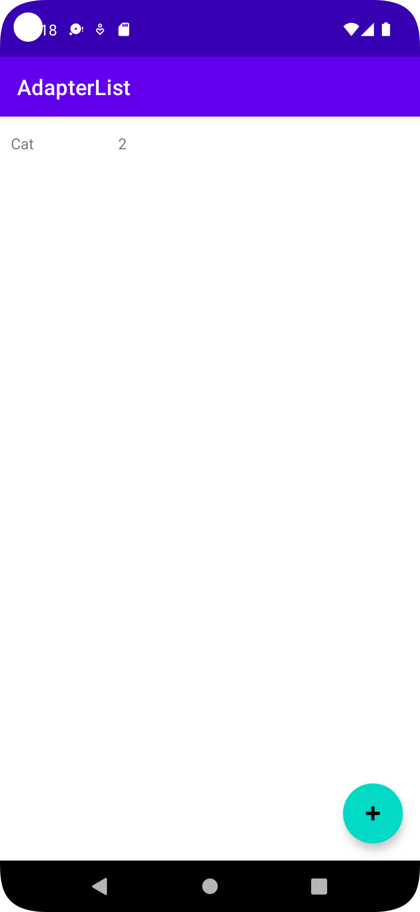
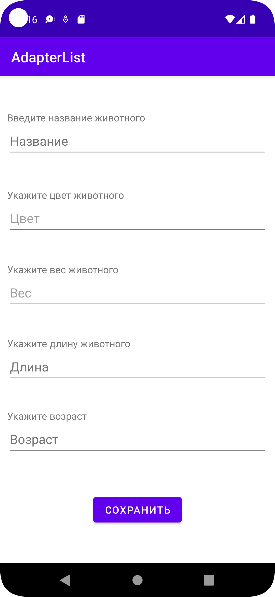
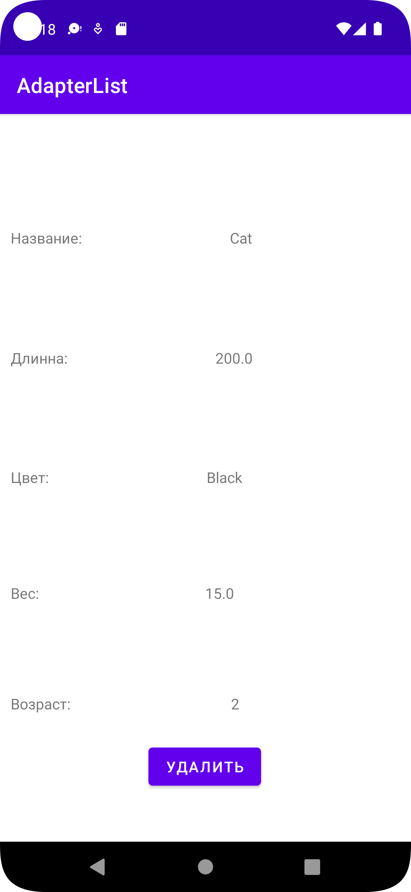

# AdapterListAndroid
Example of adapter list

Documentation(Dozywizard): https://catonearth.github.io/AdapterListAndroid/html/

    Screenshot main activity:  

    

    Screenshot add activity:  

    

    Screenshot description activity:  

    

